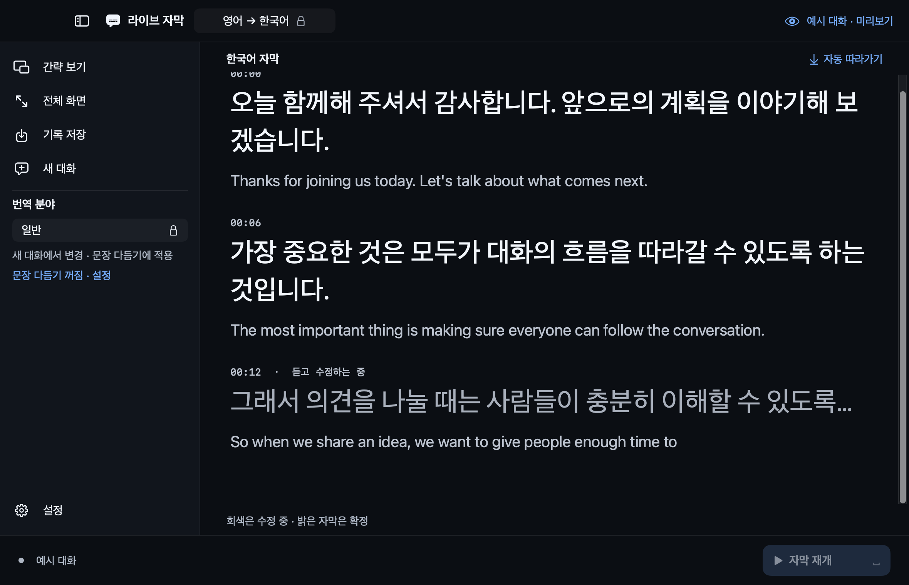

# Live Korean Captions

영어와 한국어 사이의 실시간 자막을 제공하는 macOS 앱입니다. 마이크로 한 사람의 말을 듣고, 선택한 방향으로 번역해 화면에 표시합니다. 언어 모델을 준비한 뒤에는 음성 인식과 번역을 Mac 안에서 처리합니다.



*예시 대화를 표시한 미리보기 화면입니다.*

## 주요 기능

- **양방향 자막**: 시작 전에 영어 → 한국어 또는 한국어 → 영어를 선택합니다.
- **떠 있는 자막 창**: 다른 앱 위에 간략 보기를 띄우고 위치와 크기를 조절합니다.
- **원문 함께 보기**: 상세 보기에서 원문과 번역을 함께 읽고 글자 크기를 바꿉니다.
- **기록 저장**: 대화의 전체 원문과 번역을 텍스트 파일로 내보냅니다.
- **로컬 처리**: 번역용 서버나 API 키 없이 Apple의 기기 내 음성 인식과 번역을 사용합니다.
- **선택적 번역 보완**: 작은 로컬 모델로 확정된 문장을 다시 번역합니다. 기본값은 꺼져 있습니다.

## 빌드 및 실행

Apple Silicon Mac과 macOS 26.4 이상이 필요합니다. 빌드에는 macOS 26.4 이상을 지원하는 SDK, Swift 6 이상의 도구, Python 3가 필요합니다. Xcode 또는 Command Line Tools를 설치한 뒤 실행하세요.

```sh
git clone https://github.com/SeoJHeasdw/live-ko-catption.git
cd live-ko-catption
./scripts/build-app.sh
open "dist/Live Korean Captions.app"
```

첫 빌드에서는 로컬 번역 런타임의 소스와 빌드 도구를 다운로드합니다. 생성되는 앱은 로컬 실행용 임시 서명을 사용합니다. Developer ID 서명과 공증을 거친 배포용 앱은 아닙니다. 자세한 구성은 [개발 가이드](docs/development.md)를 참고하세요.

## 처음 사용하기

1. 빈 대화에서 상단의 **번역 방향**을 선택합니다.
2. 화면 중앙의 **언어 모델 준비**를 눌러 선택한 언어의 음성 인식·번역 모델을 내려받습니다. 처음 준비할 때 인터넷이 필요하며, macOS에서 다운로드 허용을 요청할 수 있습니다.
3. 기본값인 **자동 선택 (시스템 기본)**으로 시작 시 시스템 기본 마이크를 사용합니다. 다른 장치를 쓰려면 상단의 **설정 → 마이크**에서 선택하세요. 장치 목록은 설정을 열거나 자막을 시작할 때 갱신됩니다.
4. 하단의 **자막 시작**을 누르고 macOS의 마이크 접근을 허용합니다. 시작이 완료되면 간략 보기로 전환합니다.
5. 선택한 입력 언어로 말합니다. **일시정지**로 대화를 유지한 채 입력을 멈추고, **자막 재개**로 이어갈 수 있습니다.
6. 대화가 끝나면 상세 보기 상단의 **기록 저장** 아이콘을 눌러 전체 원문과 번역을 보관합니다.

기록은 자동 저장되지 않습니다. 앱을 종료하거나 **새 대화**를 시작하기 전에 필요한 기록을 저장하세요. 번역 방향을 바꾸려면 새 대화를 시작해야 합니다.

## 보기와 조작

**간략 보기**는 최근 자막을 보여주는 반투명 창입니다. 위쪽을 드래그해 이동하고, 테두리나 모서리를 잡아 크기를 조절합니다. 긴 자막은 최신 끝부분을 표시합니다. 창에 마우스를 올리면 상세 보기, 일시정지·재개, 일시정지하고 상세 보기 버튼이 나타납니다.

**상세 보기**는 자막을 넓게 표시합니다. 상단에서 번역 방향과 기록 저장·새 대화·간략 보기·전체 화면을 조작합니다. 아이콘에 마우스를 올리면 설명이 나타납니다. 톱니바퀴 **설정**을 열면 **자막·번역·마이크** 탭에서 원문 표시, 글자 크기, 번역 옵션과 입력 장치를 바꿀 수 있습니다.

화면에는 최근 100개 표시 구절을 보여주며, 저장 파일에는 전체 기록이 포함됩니다. 자막을 직접 스크롤하면 자동 따라가기가 멈춥니다. **최신 자막으로**를 눌러 다시 켤 수 있습니다.

보기 전환과 일시정지는 현재 대화의 기록을 유지합니다. **일시정지하고 상세 보기**는 입력을 멈추고 상세 창으로 돌아옵니다.

| 단축키 | 동작 |
|---|---|
| `Space` | 자막 시작·일시정지·재개 |
| `⌘1` | 상세 보기 |
| `⌘2` | 간략 보기 |
| `⌘.` | 일시정지하고 상세 보기 |
| `⌘S` | 전체 원문·번역 기록 저장 |

단축키는 앱이 활성화된 상태에서 사용합니다.

## 자막 상태와 번역 설정

회색 자막은 인식이나 번역이 진행 중이며 내용이 바뀔 수 있습니다. 음성 인식이 확정되고 현재 원문에 대한 번역을 받으면 밝은 자막으로 표시합니다. **밝은 자막은 번역의 의미가 검증됐다는 뜻이 아닙니다.**

**설정 → 자막**에서 **원문 함께 보기**와 **자막 글자 크기**를 조절합니다. 원문 표시는 선택한 번역 방향의 입력 언어를 따릅니다.

**설정 → 번역**에서 **최근 구절 함께 번역**을 켜면 인접한 구절을 묶어 다시 번역합니다. 이때 최근 자막이 회색으로 돌아갔다가 수정될 수 있습니다. 오래된 대화 전체를 반복해서 번역하지는 않습니다.

같은 탭의 **작은 로컬 모델 사용**은 문장 다듬기를 위한 시험 기능입니다. 약 1.47 GB의 Hy-MT2-1.8B Q6_K 모델을 내려받은 뒤 켤 수 있으며, 일반·IT 분야를 선택합니다. 빠른 Apple 번역을 먼저 표시하고 확정된 원문만 보완합니다. 보완이 늦거나 실패하면 빠른 번역을 유지합니다. IT 모드는 일부 용어를 참고하지만 전문 용어의 정확성을 보장하지 않습니다. 어색한 결과가 나오면 보완을 끄세요.

## 알아둘 제한사항

- 한 대화는 한 화자와 한 번역 방향을 기준으로 합니다. 언어 자동 판별과 여러 화자 구분은 지원하지 않습니다.
- 마이크 자동 선택은 시작 시 적용됩니다. 실행 중 마이크를 바꾸려면 일시정지 후 다시 시작하세요. 다른 앱의 소리나 시스템 오디오를 직접 캡처하지 않습니다.
- 원본 음성을 녹음하거나 기록을 자동 저장하지 않습니다. 과거 전체 기록의 검색·불러오기 기능도 없습니다.
- 발음, 소음, 이름, 숫자, 부정 표현, 전문 용어에 따라 인식과 번역이 틀릴 수 있습니다. 필요한 경우 원문을 함께 확인하세요.
- 자막의 정확도와 지연은 기기와 입력 환경에 따라 달라집니다. 이 앱은 보조 자막 용도로 사용하세요.

## 개인정보와 외부 구성요소

앱은 번역용 외부 서비스에 음성이나 자막을 보내지 않습니다. 초기 언어 자산과 선택 모델 다운로드에는 인터넷을 사용하며, 준비 후 추론은 로컬에서 실행합니다. 선택 모델은 파일 크기와 SHA-256을 확인한 뒤 설치하고, 모델 가중치는 저장소나 앱 번들에 포함하지 않습니다.

로컬 번역 런타임과 모델의 출처·라이선스는 [런타임 안내](Runtime/README.txt), [llama.cpp 라이선스](Runtime/llama-cpp-LICENSE.txt), [Hy-MT2 라이선스](Resources/ThirdParty/Hy-MT2-LICENSE.txt), [모델 고지](Resources/ThirdParty/Hy-MT2-NOTICE.txt)에 있습니다.

## 개발 문서

- [개발 가이드](docs/development.md): 구조, 빌드, 검사 명령과 기여 시 주의사항
- [검증 자료 안내](docs/qa/README.md): 기능별 검사 조건, 번역 실패 사례와 원자료
